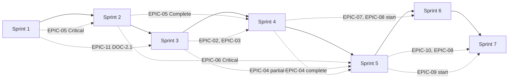

# DEPENDENCY GRAPH

This document represents all dependencies between Epics in the SIRC Remediation Plan.

## Legend

- `-->` means "depends on" (requires completion before)
- `--->>` means "strongly recommends" (better to do after, but not blocking)
- `===` means "blocks" (cannot proceed without)

---

## Epic Dependency Graph (Mermaid)

```mermaid
graph TD
    subgraph "Phase 1: Critical Blockers"
        E01[EPIC-01<br/>Pipeline Unification]
        E05_C[EPIC-05 Critical<br/>Security Blockers]
        E06_C[EPIC-06 Critical<br/>UX Blockers]
        E11_C[EPIC-11 DOC-2.1<br/>CHANGELOG Fix]
    end

    subgraph "Phase 2: Architecture Remediation"
        E02[EPIC-02<br/>MediaProjection Lifecycle]
        E03[EPIC-03<br/>Platform Detection]
        E04[EPIC-04<br/>Decision Engine]
        E11_P1[EPIC-11 P1 Docs<br/>Integrity]
    end

    subgraph "Phase 3: Quality & Stability"
        E12[EPIC-12<br/>Stability Hardening]
        E09_P1[EPIC-09 Partial<br/>Performance]
    end

    subgraph "Phase 4: UX & Design System"
        E08[EPIC-08<br/>Localization & Design]
        E06_R[EPIC-06 Remaining<br/>UX Items]
        E07[EPIC-07<br/>Presentation Architecture]
        E10_P[EPIC-10 Partial<br/>Testing Infra]
    end

    subgraph "Phase 5: Compliance & Completion"
        E05_R[EPIC-05 Remaining<br/>Security]
        E09_R[EPIC-09 Remaining<br/>Performance]
    end

    subgraph "Phase 6: Final Polish"
        E12_R[EPIC-12 Remaining<br/>Stability]
        E11_P3[EPIC-11 P3 Docs<br/>Final Polish]
        E04_P3[EPIC-04 P3 Cleanup<br/>Dead Code]
    end

    %% Phase 1 internal dependencies
    E01 === E05_C
    E01 === E06_C
    E11_C --> E01

    %% Phase 2 dependencies
    E01 --->> E02
    E01 --->> E03
    E01 --->> E04
    E02 --> E12
    E01 --> E04
    E11_C --> E11_P1
    E03 --> E04

    %% Phase 3 dependencies
    E01 --> E12
    E02 --> E12
    E03 --> E12
    E01 --->> E09_P1
    E12 --> E09_R

    %% Phase 4 dependencies
    E04 --> E07
    E07 --> E10_P
    E07 --> E08
    E08 --> E06_R
    E12 --> E06_R
    E01 --> E09_P1

    %% Phase 5 dependencies
    E05_C --> E05_R
    E06_C --> E06_R
    E09_P1 --> E09_R

    %% Phase 6 dependencies
    E09_R --> E12_R
    E04 --> E04_P3
    E11_P1 --> E11_P3
    E12 --> E12_R

    %% Cross-phase
    E11_C --> E11_P1
    E11_P1 --> E11_P3

    style E01 fill:#e74c3c,color:#fff
    style E05_C fill:#e74c3c,color:#fff
    style E06_C fill:#e74c3c,color:#fff
    style E11_C fill:#e74c3c,color:#fff
```

---

## Detailed Dependency Relationships

### Core Chain

```
EPIC-01 (Pipeline Unification)
    |
    +---> EPIC-02 (MediaProjection Lifecycle) --- EPIC-12 (Stability)
    +---> EPIC-03 (Platform Detection) --- EPIC-04 (Decision Engine)
    +---> EPIC-04 (Decision Engine) --- EPIC-07 (Presentation)
    +---> EPIC-12 (Stability Hardening)
    +---> EPIC-09 (Performance) --- EPIC-12

EPIC-05 (Security)
    |
    +---> EPIC-05 Remaining (Security Completion) --- EPIC-06 (UX Final)

EPIC-07 (Presentation)
    |
    +---> EPIC-08 (Localization/Design) --- EPIC-06 (UX Final)
    +---> EPIC-10 (Testing)
    +---> EPIC-08 (Localization/Design)

EPIC-11 (Documentation)
    |
    +---> EPIC-11 P2/P3 (Full Documentation)
```

### Blocking Dependencies (Must Complete Before)

| Blocking Epic | Blocked By | Reason |
|---|---|---|
| EPIC-02 | EPIC-01 | Lifecycle cleanup must target the unified pipeline, not two separate ones |
| EPIC-03 | EPIC-01 | Detection framework wiring requires single pipeline |
| EPIC-04 | EPIC-01 | Threshold consolidation requires knowing which engine is the authority |
| EPIC-12 | EPIC-01, EPIC-02 | Lifecycle hardening requires unified and safe pipeline |
| EPIC-07 | EPIC-04 | ViewModel refactoring requires clear decision engine interface |
| EPIC-08 | EPIC-07 | String extraction and formatting depend on ViewModel changes |
| EPIC-06 (UX final) | EPIC-08 | Contrast/text changes depend on unified design system tokens |
| EPIC-10 | EPIC-07 | ViewModel tests require testable ViewModels |
| EPIC-09 | EPIC-04, EPIC-01 | Performance optimizations require consolidated pipeline |
| EPIC-12 (remaining) | EPIC-09 | Final stability depends on performance baseline |

### Soft Dependencies (Better After, Not Blocking)

| Epic | Soft-Depends On | Reason |
|---|---|---|
| EPIC-06 (UX) | EPIC-08 | Design system provides consistent color/typography tokens |
| EPIC-05 (Security completion) | EPIC-01 | SQLCipher integration on unified database |
| EPIC-11 (P3 docs) | All implementation epics | Final docs reflect final code state |
| EPIC-12 (remaining) | EPIC-09 | Performance optimizations inform stability decisions |

### Parallelizable Epics

These epics have no interdependencies and can be worked on in parallel:

- **EPIC-05 (Security Critical)** — can start immediately alongside EPIC-01
- **EPIC-11 (Documentation)** — can run entirely in parallel with any epic
- **EPIC-04 (Decision Engine)** — after EPIC-01, can proceed independently of EPIC-02/03
- **EPIC-10 (Testing Infrastructure)** — can start setting up dependencies in parallel with EPIC-07

### Sprint-Level Dependencies



---

## Risk: Single Points of Failure

1. **EPIC-01** — If the legacy pipeline cannot be safely removed (S-S14 device verification fails), EPIC-02, EPIC-03, and EPIC-04 all block.
2. **Device Verification (S-S14)** — If `exported="false"` breaks AccessibilityService binding, the entire capture architecture needs redesign, pushing EPIC-01 to a much larger scope.
3. **EPIC-07** — If ViewModel refactoring for testability fails or introduces regressions, EPIC-08, EPIC-10, and the UX completion are all delayed.
4. **EPIC-11** — Documentation is low-risk but its absence could cause integration errors if developers rely on corrected docs.

---

## Cross-Epic Shared Modules

| Shared Module | Epics Affected |
|---|---|
| `:app` | EPIC-01, EPIC-05, EPIC-06, EPIC-07, EPIC-08, EPIC-11, EPIC-12 |
| `:feature:overlay` | EPIC-01, EPIC-02, EPIC-03, EPIC-04, EPIC-07, EPIC-09, EPIC-12 |
| `:core:capture` | EPIC-01, EPIC-02, EPIC-03, EPIC-09, EPIC-12 |
| `:core:capture:android` | EPIC-01, EPIC-02, EPIC-09, EPIC-12 |
| `:core:platform` | EPIC-03, EPIC-09 |
| `:core:ui` | EPIC-06, EPIC-08 |
| `:domain` | EPIC-04, EPIC-07, EPIC-08, EPIC-10 |
| `:data` | EPIC-04, EPIC-05, EPIC-10, EPIC-11, EPIC-12 |
| `:feature:settings` | EPIC-07, EPIC-08, EPIC-11 |
| `:feature:history` | EPIC-06, EPIC-07, EPIC-08, EPIC-10, EPIC-11 |
| `:feature:onboarding` | EPIC-04, EPIC-07, EPIC-08, EPIC-10, EPIC-12 |

---

## Implementation Order Justification

1. **EPIC-01 first** — The duplicate pipeline is the root cause of many other issues (double processing, resource waste, debug complexity)
2. **EPIC-05 second (parallel)** — Security compliance cannot be delayed; Beta submission depends on it
3. **EPIC-02 third** — Once pipeline is unified, lifecycle cleanup is targeted at one place
4. **EPIC-03 fourth** — Platform detection is tied to pipeline architecture
5. **EPIC-04 fifth** — Decision engine consolidation requires stable pipeline and detection
6. **EPIC-07 sixth** — Presentation layer depends on clean domain/data interfaces
7. **EPIC-08 seventh** — Design system can build on clean architecture
8. **EPIC-06 eighth** — UX polish requires design system foundation
9. **EPIC-10 ninth** — Testing requires testable code (after EPIC-07)
10. **EPIC-09 tenth** — Performance after structural changes
11. **EPIC-12 eleventh** — Stability hardening after core changes
12. **EPIC-11 throughout** — Documentation can happen at any time

*End of DEPENDENCY_GRAPH.md*
