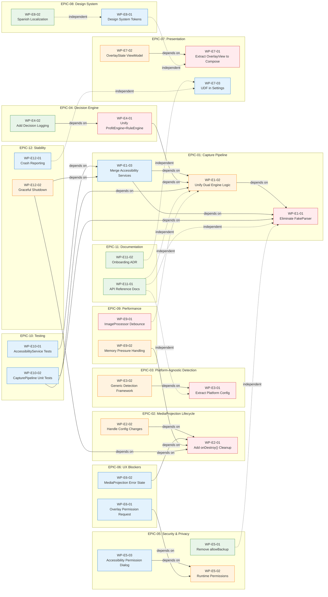
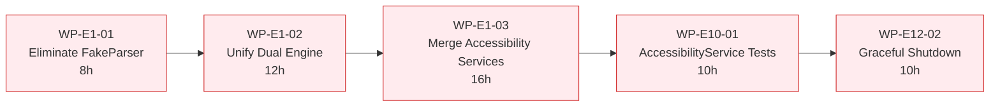
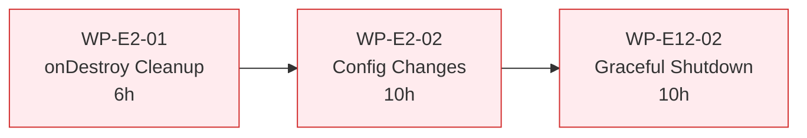
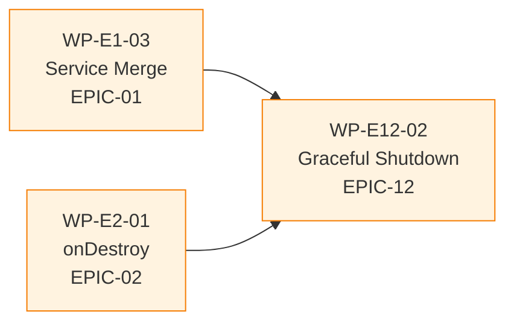
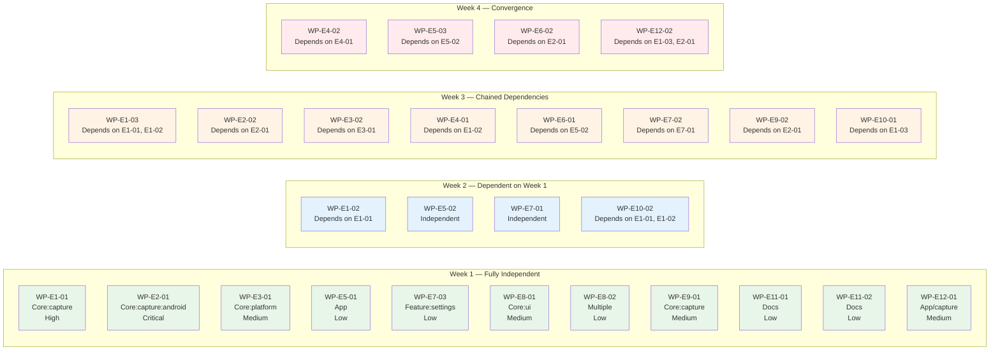

# Dependency Graph — Work Packages

**Date:** 2026-08-02  
**Scope:** Dependencies between 33 Work Packages across 12 Épicas  
**Format:** Mermaid.js graph (LR layout for horizontal reading)

---

## Full WP Dependency Graph

---

## Critical Path

### Longest Chain (56 hours)

### Secondary Chain (26 hours)

---

## Convergence Point

**WP-E12-02 depends on both WP-E1-03 and WP-E2-01** — this is the convergence point where EPIC-01 and EPIC-02 merge.

---

## Parallelization Opportunities

### Week 1 — 11 Independent WPs (Peak Parallelism)

---

## Module-Level Dependency Heatmap

| Module | WPs | Internal Dependencies | External Dependencies |
|---|---|---|---|
| `core:capture` | E1-01, E1-02, E4-01, E4-02, E9-01, E10-02 | E1-02→E1-01, E4-01→E1-02, E4-02→E4-01, E10-02→E1-01+E1-02 | E1-01→app (no) |
| `core:capture:android` | E2-01, E2-02, E9-02, E12-02 | E2-02→E2-01, E9-02→E2-01, E12-02→E2-01 | E12-02→E1-03 (feature:overlay) |
| `core:platform` | E3-01, E3-02 | E3-02→E3-01 | None |
| `core:ui` | E8-01, E6-02 | — | E6-02→E2-01 |
| `feature:overlay` | E1-03, E6-02, E7-01, E7-02, E10-01, E12-02 | E1-03→E1-02, E7-02→E7-01, E10-01→E1-03, E12-02→E1-03 | None |
| `feature:onboarding` | E5-02, E5-03, E6-01, E11-02 | E5-03→E5-02, E6-01→E5-02 | None |
| `feature:settings` | E7-03 | — | None |
| `feature:history` | — | — | None |
| `app` | E5-01, E12-01 | — | None |
| `data` | — | — | None |
| `domain` | — | — | None |

---

## Legend

| Symbol | Meaning |
|---|---|
| `──→` | Direct dependency (must complete before) |
| `-.->` | Soft/independent relationship |
| 🔴 Critical | Must not be delayed — blocks downstream work |
| 🟠 High | Should prioritize after critical |
| 🟡 Medium | Can parallelize with other medium/low |
| 🟢 Low | Independent, can run anytime |
| ⚪ Independent | No dependencies at all |
